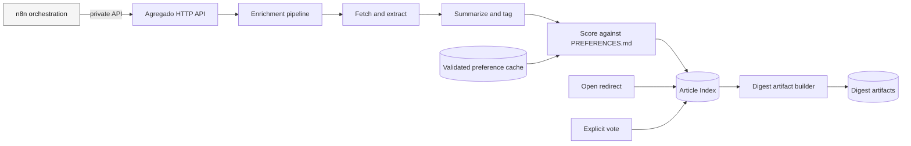
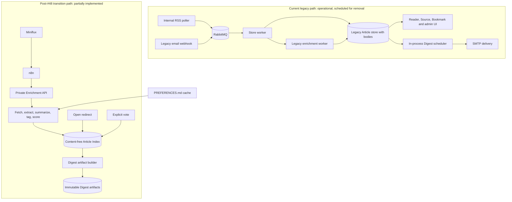
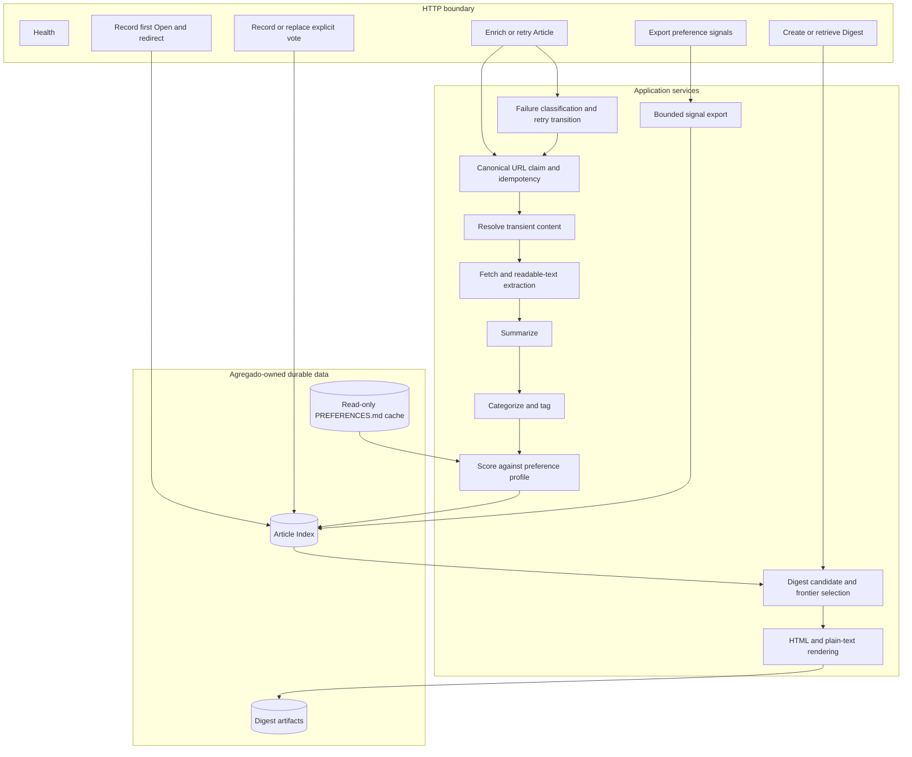
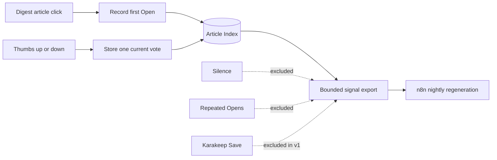

# Agregado architecture

**Status:** Target architecture, with current and transitional states recorded

**Last reviewed:** 2026-09-24

**Roadmap anchor:** [#48: Pivot, adopt the reader, build the enrichment layer and the bookmarker](https://github.com/ffrt-labs/agregado/issues/48)

## Purpose

Agregado is a single-user, headless service that enriches and scores Articles,
keeps a content-free Article Index, records limited preference evidence, and
builds immutable daily Digest artifacts. It is one component in a larger
Reader workflow; it is not the Source manager, Article content store,
orchestrator, email sender, or Bookmarker.

This document distinguishes three states:

- **Current:** code that starts today, including the legacy monolith.
- **Transition:** the post-pivot path already implemented while migration and
  cutover remain incomplete.
- **Target:** the surviving system after issues #84 and #85.

When sources disagree, the order of authority is confirmed product intent,
issues #48 onward, then current implementation. A difference is recorded as a
gap rather than silently resolved.

## Architecture at a glance



The central constraint is content ownership: ordinary Article bodies remain in
Miniflux. Agregado temporarily handles fetched or Bridge-supplied content while
computing Enrichment but never persists that content in the target design.

## Current and transitional architecture

Agregado presently contains two architectures in one process.



The transition path already includes the private Enrichment endpoint, Article
Index, Digest artifact generation, Open and explicit-vote capture, preference
signal export, and the ownership-migration command. The Bridge's Cloudflare
Worker now serves its D1/R2-backed feeds and permalinks. The Resend-to-n8n
ingestion workflow, Miniflux reconciliation, production cutover, and removal of
the legacy system are not complete.

## Target component architecture



### Responsibilities

| Component | Owns | Must not own |
|---|---|---|
| HTTP boundary | Small private orchestration API and tailnet-only Digest actions | General UI, Source CRUD, public administration |
| Enrichment pipeline | Fetching, readable extraction, summary, tags, Score, failure classification | Persistent Article bodies, Source subscriptions |
| Article Index | Canonical identity, optional Miniflux provenance, Enrichment, status, first Open, current vote | Article content, duplicate preference events |
| Digest builder | Candidate selection, diversity, exploration picks, ordering, rendering, immutable artifact | Scheduling or email delivery |
| Preference reader | Validated local `PREFERENCES.md` snapshot | Editing or synchronizing the authoritative file |
| PostgreSQL | Article Index, Digest artifacts, compact behavioral history | n8n execution state, Miniflux content, Bookmarks |

## Core workflows

### Article Enrichment and recovery

```mermaid
sequenceDiagram
    participant N as n8n
    participant A as Agregado API
    participant I as Article Index
    participant W as Web
    participant M as AI models
    participant P as PREFERENCES.md

    N->>A: Enrich Article metadata
    A->>I: Claim canonical URL
    alt already complete
        I-->>A: Existing result
        A-->>N: Idempotent success
    else new or explicitly retryable failure
        A->>W: Fetch canonical page or use inline Bridge content
        W-->>A: Readable content
        A->>M: Summarize and tag using cheap-capable route
        A->>P: Read validated preference profile
        A->>M: Score against profile
        A->>I: Persist derived data; never persist body
        A-->>N: Complete Article Index record
    else processing fails
        A->>I: Persist retryable or terminal failure and attempt metadata
        A-->>N: Structured failure
        Note over N,A: n8n schedules bounded retries
    end
```

Canonical URL is the identity and idempotency key for ordinary Articles. An
email-only Article uses the Bridge permalink UUID when no canonical URL can be
recovered. `miniflux_entry_id` is optional provenance for troubleshooting, not
an identity and not a Decoration writeback contract in the confirmed target.

### Daily Digest artifact

```mermaid
sequenceDiagram
    participant N as n8n
    participant A as Agregado
    participant I as Article Index
    participant M as Frontier model
    participant D as Digest store

    N->>A: Get or create Digest since previous successful Digest
    A->>D: Look up immutable artifact
    alt artifact exists
        D-->>A: Existing artifact
    else artifact absent
        A->>I: Load newly enriched candidates
        A->>A: Deduplicate; quality floor; soft diversity; exploration top-up
        A->>M: One batched ordering and why-it-matters call
        A->>D: Persist subject, HTML, text, selection and counts
    end
    A-->>N: Complete artifact
```

The candidate window is based on successful Enrichment since the previous
successful Digest, with a bounded fallback lookback. It is not a UTC
`published_at` calendar day.

### Preference evidence



An Open is weak evidence; an explicit vote is strong evidence. Silence,
repeated Opens, Bookmarks, and Karakeep data do not teach the profile in v1.

## Target API surface

| Exposure | Endpoint responsibility |
|---|---|
| Tailnet private + shared secret | Enrich or retry an Article |
| Tailnet private + shared secret | Create or retrieve a Digest artifact |
| Tailnet private + shared secret | Export bounded preference signals |
| Tailnet only | Record first Open and redirect to canonical URL |
| Tailnet only | Record or replace an explicit vote |
| Tailnet only | Health and readiness |

The precise route names may evolve. The responsibility set is the architectural
contract. No user accounts or general application authentication are planned.
Tailscale controls network reachability; the shared secret authorizes n8n-facing
mutations.

## Data lifecycle

Article Index records, Digest artifacts, first Opens, and current explicit votes
are retained indefinitely at single-user scale. Operational logs and detailed
attempt history should be bounded separately, initially to 30 to 90 days.

Digest artifacts are immutable per logical Digest window. Preference learning
uses current compact evidence, not an unbounded raw click log.

## Removal and gap map

| Area | Current state | Target state | Gate |
|---|---|---|---|
| RSS intake | Internal poller | Miniflux | Production cutover #84 |
| Queueing | RabbitMQ, consumers and DLQ | n8n orchestration and reconciliation | #84, then removal #85 |
| Article content | Legacy PostgreSQL body mirror | Miniflux only | Migrated ownership verified in #83 |
| Newsletter intake | Legacy direct webhook is being replaced; Worker read paths and D1/R2 storage exist | Resend receives, n8n parses and writes, Worker serves private Atom and permalinks | ADR-0007 build sequence, then #84 |
| Enrichment | Legacy weights and new profile path coexist | One content-free Article Index pipeline | #84/#85 |
| Failure recovery | Failed canonical URL cannot be retried | Explicit retry transition; n8n owns schedule | New implementation slice |
| Digest | Internal cron and SMTP plus artifact builder | Artifact builder only | #84/#85 |
| Candidate window | UTC `published_at` day | Since previous successful Digest | New implementation slice |
| Preference profile | Local file requirement partially wired | Drive-authoritative, validated cache, automatic regeneration | #89 plus n8n workflows |
| Reader/admin UI | Full HTMX surface | Removed | #85 |
| Bookmarks | Legacy local bookmark fields/UI | Karakeep, completely outside Agregado | #83/#85 |
| Ingress | Cloudflare Tunnel routes public read paths to Agregado and the Resend webhook to n8n | Agregado uses Tailscale Serve only; Cloudflare keeps only the Bridge route to n8n | #84 and ADR-0008 |
| Model selection | One configured model | Task-tiered routing; stronger daily frontier call | Deferred bake-off #86 |

## Known decision and documentation drift

- `CONTEXT.md` and ADR-0006 still describe retaining a Miniflux entry ID for
  Decoration writeback. The confirmed target has no Decoration edge; the ID is
  optional provenance only. Those older descriptions require a focused
  amendment rather than being treated as target behavior.
- `CONTEXT.md` still calls a Save-signal the strongest preference evidence.
  The confirmed v1 target excludes Karakeep and Bookmarks from preference
  regeneration. Reintroducing that edge requires a later decision.
- ADR-0001 and ADR-0007 remain the correct description of the Bridge's public
  Resend-to-n8n ingress. ADR-0008 removes only Cloudflare routes whose origin is
  Agregado after #84 moves the app to tailnet-only access.
- The running Compose configuration still reflects RabbitMQ and internal SMTP
  delivery, and it does not fully provide the new preference-path and private
  API configuration. Its `cloudflared` container now also routes the Bridge's
  Resend webhook to n8n, so that responsibility survives even when Cloudflare
  stops routing to Agregado.
- The implemented Digest uses a UTC `published_at` day. The target's
  since-previous-success window is a confirmed follow-up change, not a claim
  about current behavior.

## Refactoring gates

Deep restructuring follows the ownership migration rather than preceding it:

1. Finish the Bridge's Resend-to-n8n ingestion workflow and the other target workflows.
2. Produce a final restorable legacy PostgreSQL backup.
3. Dry-run and reconcile the ownership-based migration.
4. Complete human-supervised production cutover in #84.
5. Exercise rollback while the old system remains intact.
6. Delete superseded responsibilities in #85.
7. Refactor the smaller surviving system around the target components above.

## Evidence and related decisions

- [Domain language](../../CONTEXT.md)
- [ADR-0005: Enrichment is a library; scoring is not](../adr/0005-enrichment-is-a-library-scoring-is-not-in-it.md)
- [ADR-0006: Miniflux is the Reader backend](../adr/0006-miniflux-is-the-reader-backend-not-a-service.md)
- [ADR-0007: Resend, n8n, and Worker Bridge split](../adr/0007-resend-n8n-cloudflare-split-for-newsletter-ingestion.md)
- [ADR-0008: Agregado is tailnet-only](../adr/0008-agregado-is-tailnet-only.md)
- [Article Index orchestration contract](../article-index-api.md)
- [#77: Enrich one Miniflux Article](https://github.com/ffrt-labs/agregado/issues/77)
- [#79: Generate a complete ranked daily Digest artifact](https://github.com/ffrt-labs/agregado/issues/79)
- [#80: Capture explicit feedback](https://github.com/ffrt-labs/agregado/issues/80)
- [#81: Regenerate PREFERENCES.md](https://github.com/ffrt-labs/agregado/issues/81)
- [#83: Ownership-based migration](https://github.com/ffrt-labs/agregado/issues/83)
- [#84: Production cutover](https://github.com/ffrt-labs/agregado/issues/84)
- [#85: Remove the superseded system](https://github.com/ffrt-labs/agregado/issues/85)

## Excalidraw v2

The Mermaid views intentionally separate context, components, sequences, and
migration state. An Excalidraw version should preserve those as separate frames
rather than compressing them into one canvas. Use stable colors for ownership:
Agregado, orchestrator, external authorities, and legacy-to-delete. Do not add
new edges in Excalidraw that are absent from the version-controlled model.
