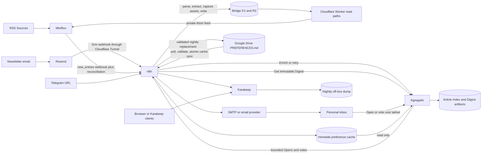
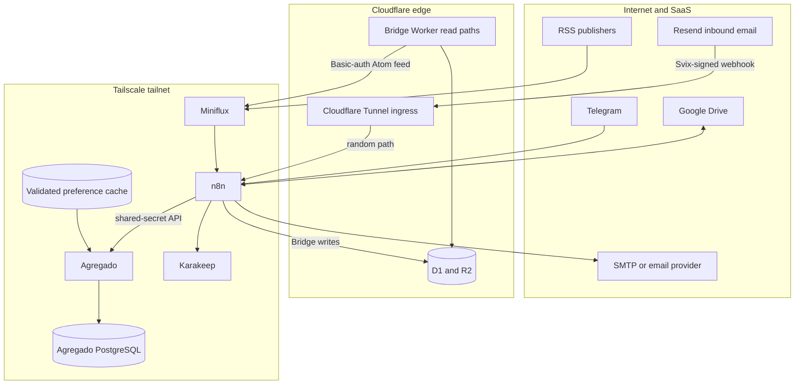
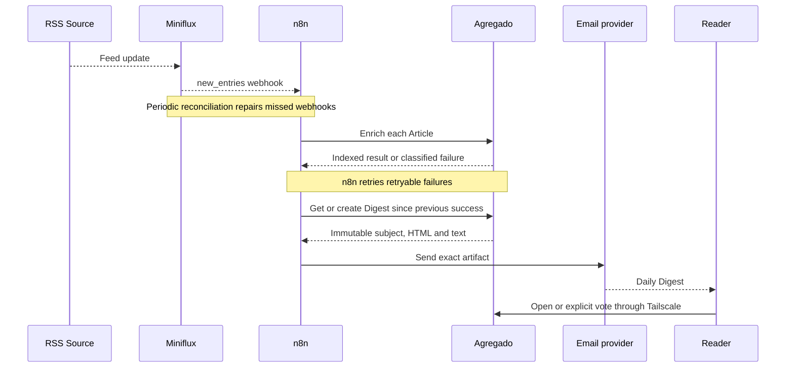
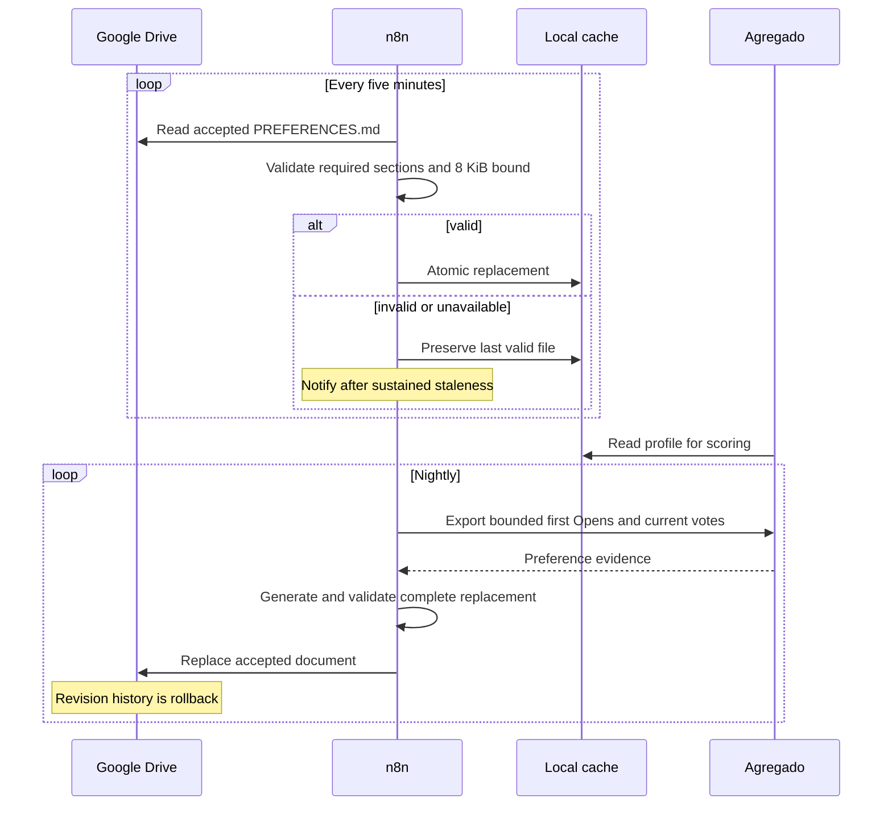
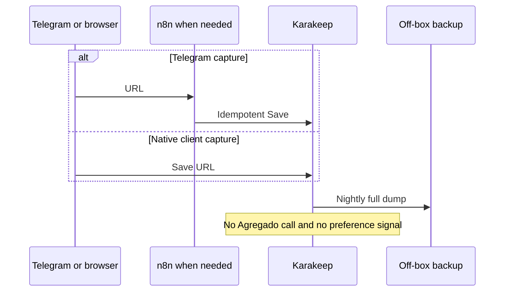
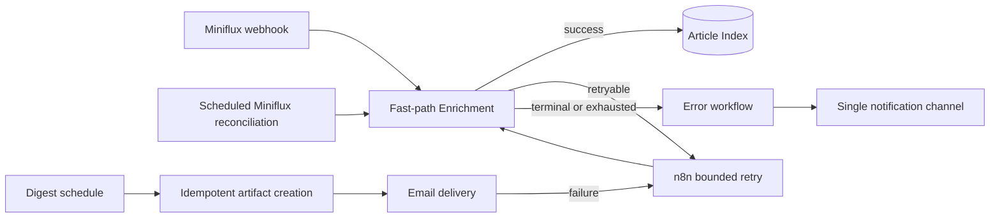
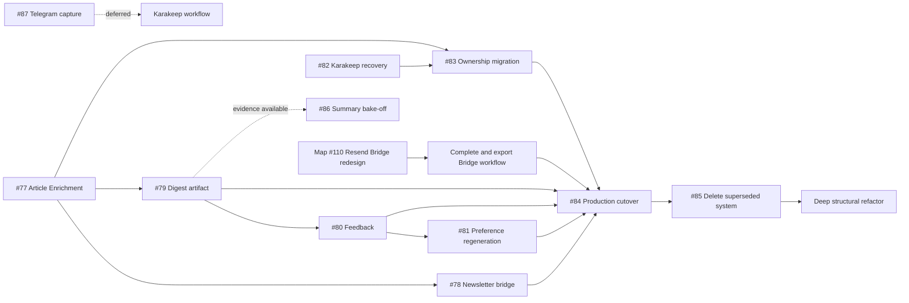

# Reader ecosystem architecture

**Status:** Target architecture, with transition and roadmap context

**Last reviewed:** 2026-09-24

## Purpose

The Reader ecosystem composes focused tools. Agregado supplies Enrichment,
scoring, preference evidence, and Digest artifacts; n8n supplies the workflow;
the surrounding products retain authority over the data they are designed to
own.



There is deliberately no Agregado-to-Karakeep edge. Bookmarks and Reader
preference evidence coexist in the personal information system but do not share
data in v1.

## System boundaries and authorities

| System | Authority | Key responsibilities | Explicit exclusions |
|---|---|---|---|
| Miniflux | Sources and the Reader copy of Article content | Poll, parse, deduplicate, retain and prune Articles | Scoring, daily reading UI, preference learning |
| Bridge | Newsletter conversion and email-only permalink content | Resend receives; n8n verifies, extracts, captures assets and writes; D1/R2 store; Worker serves Atom and permanent UUID permalinks | Enrichment, scoring, Bookmarks |
| n8n | Orchestration state | Event routing, reconciliation, retries, schedules, profile synchronization/regeneration, email delivery, failure notification, Telegram capture | Article content authority, Score policy |
| Agregado | Article Enrichment and Reader behavioral history | Fetch/extract, summarize, tag, Score, Article Index, Open/vote evidence, immutable Digest artifacts | Sources, Article bodies, Bookmarks, SMTP scheduling |
| Google Drive | Accepted `PREFERENCES.md` | Editable authoritative profile and revision rollback | Runtime serving to Agregado |
| Preference cache | Last validated runtime snapshot | Atomic local file read by Agregado | Independent edits or policy authority |
| Karakeep | Bookmarks and the Pile | Immutable readable archive, read/unread lifecycle, capture clients | Reader Enrichment, Reader feedback, profile learning in v1 |
| SMTP/email provider | Digest transport | Deliver exactly the artifact supplied by n8n | Selection or rendering policy |
| Cloudflare Tunnel | Public Bridge webhook ingress | Route the random Resend path to n8n and apply a scoped rate limit | Agregado access after cutover |
| Tailscale | Agregado network reachability | Tailnet membership, ACLs, HTTPS exposure through Serve | n8n workload authorization; the shared secret remains |

## Trust and deployment view



The Bridge needs public ingress so Resend can reach n8n. Its Worker also serves
the private Atom feeds and unguessable permalinks from Cloudflare. Agregado
itself becomes tailnet-only. Digest Open and vote links will not work on a
device that is disconnected from the tailnet. Tailscale Funnel is not part of
the target.

## End-to-end workflows

### RSS Article to Digest



### Newsletter Article

```mermaid
sequenceDiagram
    participant R as Resend
    participant N as n8n Bridge workflow
    participant S as D1 and R2
    participant W as Cloudflare Worker
    participant M as Miniflux
    participant A as Agregado

    R->>N: Svix-signed email.received webhook
    N->>N: Verify signature and fetch full message
    N->>N: Resolve Source alias; extract URL and readable content
    N->>N: Capture remote assets and sanitize two representations
    N->>S: Upsert D1 metadata and R2 content by hash(Message-ID)
    N->>A: Enrich with extracted content inline
    W->>S: Read entry data
    M->>W: Poll Basic-auth Atom feed
    W-->>M: Feed entry
    alt canonical page exists
        Note over A: Canonical URL identifies the Article
    else email-only Article
        Note over S,W: R2-backed UUID permalink remains self-contained
        Note over A: Bridge permalink UUID identifies the Article
    end
    Note over A: Article body is never persisted in Agregado
```

### Preference synchronization and learning



### Bookmark capture



## n8n workflow source model

Workflows coupled to Agregado's API belong in this repository as sanitized,
importable definitions:

```text
n8n/workflows/
├── newsletter-ingestion.json
├── article-enrichment.json
├── article-reconciliation.json
├── daily-digest.json
├── preferences-sync.json
├── preferences-regeneration.json
└── error-handler.json
```

Those files are separate implementation slices from these architecture docs.
ADR-0007 already requires the exported newsletter workflow in this repository.
They must contain no credentials, tokens, environment-specific host IDs, or
private profile content. The n8n deployment repository continues to own the
instance, database, encryption key, secrets, backups, and import procedure.

Every workflow definition should declare:

- trigger and schedule;
- idempotency key;
- retry/backoff and terminal-failure rule;
- input/output contract;
- credential placeholders;
- error-workflow connection;
- reconciliation behavior;
- live import and smoke-test evidence.

## Reliability model



The webhook is a latency optimization, not the correctness mechanism.
Reconciliation makes processing eventual. Agregado returns structured failures
and processing state; n8n owns retry timing and notification.

## Roadmap and cutover



The old system remains a migration source and rollback option until #84 is
complete. Removal in #85 precedes the major refactor so the refactor works on
the intended product rather than reorganizing code scheduled for deletion.

## Explicitly deferred decisions

- Sync mechanism between committed n8n JSON and the live n8n instance.
- Final ownership of the shared `cloudflared` container after Agregado stops
  receiving public traffic.
- Summary strategy and final model-routing table, to be decided by #86.
- Exact SMTP provider, because the architecture requires SMTP-like delivery but
  no provider-specific behavior.
- Search or retrieval over the permanent Bookmark archive; build only after
  demonstrated need.
- Reintroducing Save-signals into preference learning; excluded in v1.

## Related documentation

- [Agregado-specific architecture](agregado.md)
- [Domain language](../../CONTEXT.md)
- [ADR-0007: Resend, n8n, and Worker Bridge split](../adr/0007-resend-n8n-cloudflare-split-for-newsletter-ingestion.md)
- [ADR-0008: Agregado is tailnet-only](../adr/0008-agregado-is-tailnet-only.md)
- [Newsletter ingestion build plan](../newsletter-ingestion-resend-n8n-plan.md)
- [#48: Pivot map](https://github.com/ffrt-labs/agregado/issues/48)
- [#82: Karakeep backup and restore](https://github.com/ffrt-labs/agregado/issues/82)
- [#87: Telegram to Karakeep](https://github.com/ffrt-labs/agregado/issues/87)
- [#89: PREFERENCES.md storage and review boundary](https://github.com/ffrt-labs/agregado/issues/89)

## Excalidraw v2

Use separate frames for ecosystem context, trust/deployment boundaries, four
end-to-end workflows, and the cutover sequence. Preserve data-authority labels
and the absence of an Agregado-to-Karakeep edge. Excalidraw is a presentation layer;
these Markdown diagrams remain the diffable architecture source of truth.
